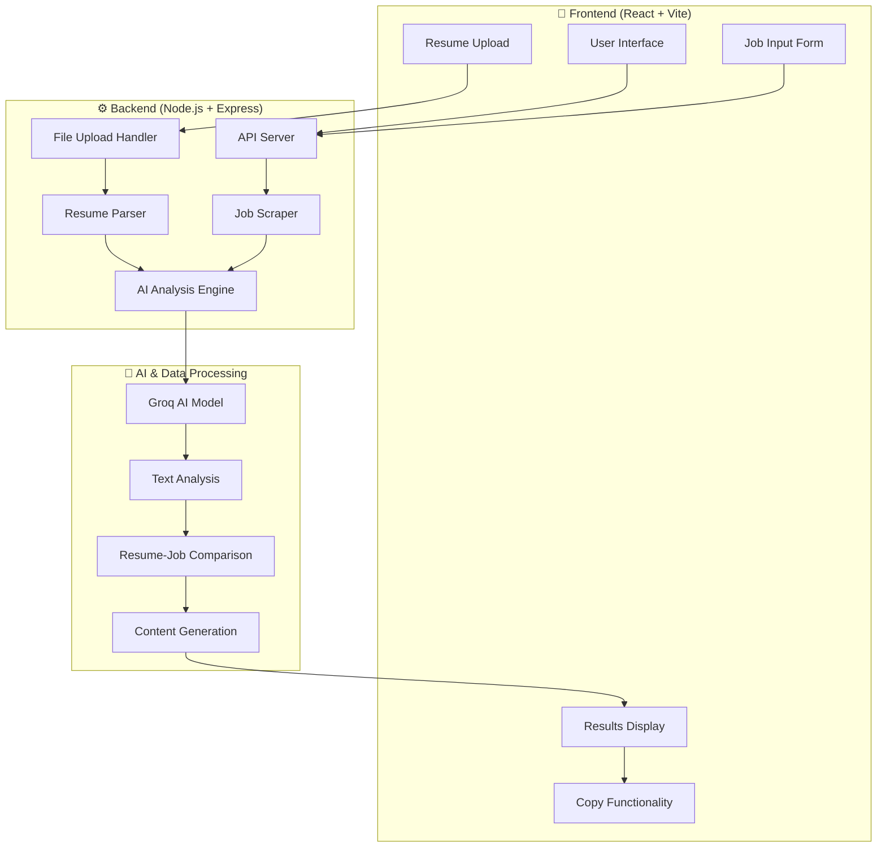
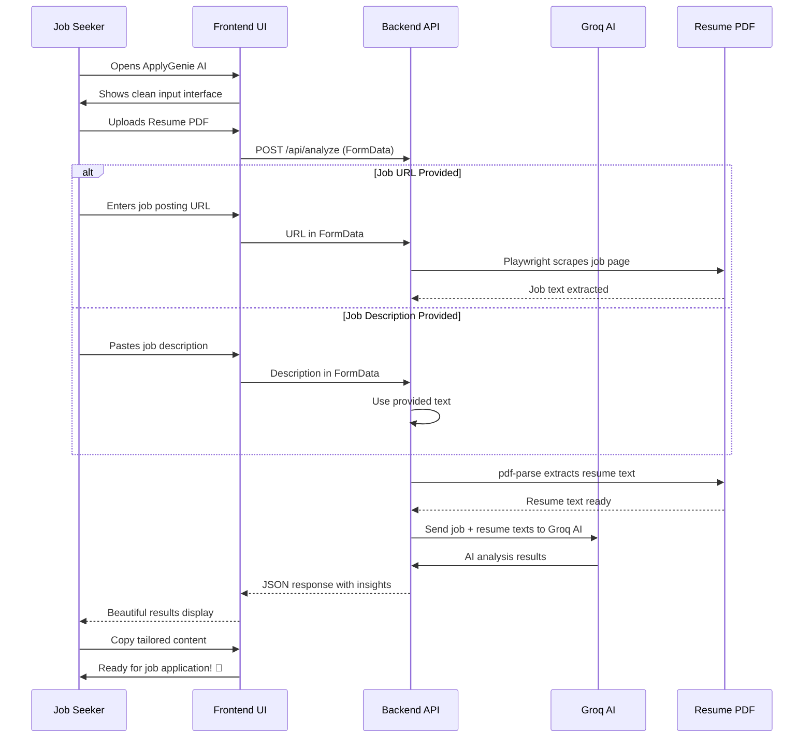

# 🎯 ApplyGenie AI - The Ultimate Job Application Agent

<div align="center">


**Transform your job search with AI-powered insights and personalized application strategies**

[🚀 Live Demo](#) • [📖 Documentation](#) • [🛠️ API Reference](#api-documentation)

</div>

---

## ✨ What is ApplyGenie AI?

**ApplyGenie AI** is an intelligent full-stack web application that revolutionizes the job application process. It analyzes your resume against job descriptions using advanced AI to provide:

- 🎯 **Personalized Match Scores** - Real compatibility analysis
- 🔍 **Skills Gap Analysis** - What you're missing vs. what's required  
- 📝 **Tailored Application Content** - AI-generated cover letters and answers
- 💡 **Resume Optimization** - Specific improvement suggestions
- 🤖 **Intelligent Job Scraping** - Automatic job posting extraction

### 🎨 Beautiful UI with Professional Design

- **Clean Interface**: Modern glassmorphism design with smooth animations
- **Responsive Layout**: Works perfectly on desktop, tablet, and mobile
- **Interactive Elements**: Hover effects, progress bars, and copy-to-clipboard functionality
- **Real-time Feedback**: Loading states and error handling

---

## 🏗️ Architecture Overview



---

## 🔄 How ApplyGenie AI Works

### 📋 Step-by-Step Workflow



### 🎯 Core Features Breakdown

#### 1. **Resume Intelligence** 📄
- **PDF Upload**: Secure file handling with validation
- **Text Extraction**: Advanced PDF parsing using pdf-parse
- **Content Analysis**: AI understands your experience and skills

#### 2. **Job Posting Analysis** 🔍
- **URL Scraping**: Playwright extracts job details automatically
- **Manual Input**: Paste job descriptions directly
- **Smart Parsing**: Identifies requirements, skills, and company culture

#### 3. **AI-Powered Matching** 🤖
- **Resume-Job Comparison**: Groq AI analyzes compatibility
- **Skills Mapping**: Matches your experience to job requirements
- **Gap Analysis**: Identifies missing skills and experience

#### 4. **Content Generation** ✍️
- **Tailored Answers**: "Why should we hire you?" responses
- **Cover Messages**: Professional introduction letters
- **Resume Suggestions**: Specific bullet point improvements

---

## 🚀 Quick Start

### Prerequisites
- ✅ Node.js 18+
- ✅ npm or yarn
- ✅ Git

### ⚡ One-Command Setup

```bash
# Clone and run everything
git clone https://github.com/Akkii88/ApplyGenie.AI-JobApplicationAgent.git
cd ApplyGenie.AI-JobApplicationAgent

# Install all dependencies
npm run install-all

# Start both frontend and backend
npm run start
```

### 🔧 Manual Setup

#### Backend Setup
```bash
cd server
npm install

# Create environment file
cp .env.example .env
# Edit .env with your GROQ_API_KEY

npm run dev
```

#### Frontend Setup
```bash
cd ../stitch-ui
npm install
npm run dev
```

### 🌐 Access the Application

- **Frontend**: http://localhost:5173
- **Backend API**: http://localhost:5001
- **Health Check**: http://localhost:5001/health

---

## 📖 Detailed Usage Guide

### 🎯 For Job Seekers

#### Step 1: Prepare Your Documents
```
📄 Resume Requirements:
   • PDF format only
   • Max 5MB file size
   • Text must be selectable (not image-based)
   • Include your work experience and skills

🔍 Job Posting Options:
   • Copy the job URL from company career pages
   • Or paste the complete job description
```

#### Step 2: Start the Analysis
```
1. Open ApplyGenie AI in your browser
2. Upload your resume PDF
3. Enter job URL or paste job description
4. Click "Run Agent"
5. Wait for AI analysis (10-20 seconds)
```

#### Step 3: Review Your Results
```
📊 Match Score: Your compatibility percentage
🛠️  Strong Matches: Skills you have that match
⚠️  Missing Skills: Gaps to address
💬 Tailored Answer: "Why hire me?" response
✉️  Cover Message: Professional introduction
💡 Resume Suggestions: Specific improvements
```

#### Step 4: Apply with Confidence
```
✨ Copy the AI-generated content
🎨 Customize it with your personal touch
📤 Submit your optimized application
🎉 Land more interviews!
```

### 🎨 Example Workflow

```
Input:
├── Resume: john_developer.pdf
├── Job URL: https://company.com/jobs/senior-frontend

AI Analysis:
├── Match Score: 87%
├── Strong Matches: React, TypeScript, UI/UX
├── Missing Skills: GraphQL, Testing frameworks
├── Tailored Answer: "With 5+ years building scalable React apps..."
├── Cover Message: "I'm excited to apply for the Senior Frontend role..."
├── Resume Suggestions: "Add testing experience", "Highlight React projects"

Output: Ready-to-use application content! 🚀
```

---

## 🔌 API Documentation

### 🏥 Health Check
```http
GET /health
```

**Response:**
```json
{
  "status": "ok",
  "aiProvider": "Groq",
  "model": "llama-3.3-70b-versatile"
}
```

### 📊 Job Analysis
```http
POST /api/analyze
Content-Type: multipart/form-data
```

**Form Data:**
- `jobLink` (string, optional): Full URL to job posting
- `jobDescription` (string, optional): Complete job description text
- `resumeFile` (file, required): Resume in PDF format

**Response:**
```json
{
  "summary": "Senior Frontend Developer role...",
  "skills": ["React", "TypeScript", "CSS"],
  "matchScore": 87,
  "strongMatches": ["React development", "TypeScript expertise"],
  "missingSkills": ["GraphQL", "Testing frameworks"],
  "tailoredAnswer": "With 5 years of experience...",
  "coverMessage": "I am excited to apply...",
  "resumeSuggestions": ["Add testing experience", "Highlight projects"],
  "rewrittenBullets": ["Led development of...", "Implemented..."]
}
```

**Error Responses:**
```json
// Invalid file type
{
  "error": "Please upload a PDF resume."
}

// Missing resume
{
  "error": "Please upload your resume PDF"
}

// Missing job input
{
  "error": "Please provide either a job description or a job link"
}
```

---

## 🎨 UI Components & Features

### 🖥️ Main Interface

```
┌─────────────────────────────────────────┐
│ 🎯 ApplyGenie AI Header                 │
├─────────────────────────────────────────┤
│ 📋 Input Panel                          │
│ ├── Job URL/Description Input           │
│ └── Resume PDF Upload                   │
│                                         │
│ ⚡ Run Agent Button                     │
│     └── Loading: "Agent analyzing..."   │
├─────────────────────────────────────────┤
│ 📊 Results Panel (shows after analysis) │
│ ├── Match Score Circle                  │
│ ├── Strong Matches List                 │
│ ├── Missing Skills List                 │
│ ├── Tailored Answer Card                │
│ ├── Cover Message Card                  │
│ └── Resume Suggestions List             │
└─────────────────────────────────────────┘
```

### ✨ Interactive Features

- **🔄 Loading Animations**: Smooth progress indicators
- **📋 Copy to Clipboard**: One-click copying with feedback
- **🎨 Hover Effects**: Subtle animations and color changes
- **📱 Responsive Design**: Adapts to all screen sizes
- **⚡ Real-time Validation**: Immediate feedback on inputs

### 🎯 Key UI States

#### Before Analysis
- Clean input form with upload area
- Placeholder text and helpful hints
- Disabled run button until resume uploaded

#### During Analysis
- Animated loading indicator
- "Agent analyzing..." status message
- Disabled inputs and button

#### After Analysis
- Beautiful results cards with data
- Copy buttons on text sections
- Match score with animated progress
- Skills displayed as interactive tags

---

## 🛠️ Technical Implementation

### 🎨 Frontend Architecture

```
stitch-ui/
├── src/
│   ├── components/
│   │   └── DemoBlock.tsx     # Main UI component
│   ├── index.css             # Tailwind + custom styles
│   └── main.jsx              # React entry point
├── tailwind.config.js        # UI theming
├── vite.config.js            # Build configuration
└── package.json              # Frontend dependencies
```

### ⚙️ Backend Architecture

```
server/
├── server.js                 # Express API server
├── aiService.js              # Groq AI integration
├── scraperService.js         # Playwright job scraping
├── .env.example              # Environment template
└── package.json              # Backend dependencies
```

### 🔧 Key Technologies

| Component | Technology | Purpose |
|-----------|------------|---------|
| **Frontend** | React 18 + TypeScript | Modern UI development |
| **Build Tool** | Vite | Fast development server |
| **Styling** | Tailwind CSS | Utility-first CSS framework |
| **Animations** | Framer Motion | Smooth transitions |
| **Backend** | Node.js + Express | RESTful API server |
| **File Upload** | Multer | Multipart form handling |
| **PDF Parsing** | pdf-parse | Resume text extraction |
| **Web Scraping** | Playwright | Job posting extraction |
| **AI Engine** | Groq AI | Intelligent text analysis |

---

## 🤝 Contributing

We welcome contributions! Here's how to get started:

### Development Setup
```bash
# Fork the repository
# Clone your fork
git clone https://github.com/your-username/ApplyGenie.AI-JobApplicationAgent.git

# Set up development environment
npm run install-all
npm run start

# Make your changes
# Test thoroughly
# Submit a pull request
```

### Guidelines
- 🔍 **Code Quality**: Follow TypeScript best practices
- 🧪 **Testing**: Test all features before submitting
- 📝 **Documentation**: Update docs for new features
- 🎨 **UI/UX**: Maintain the clean design aesthetic
- 🔒 **Security**: Never commit sensitive data

### Areas for Contribution
- 🌐 **Internationalization**: Add multi-language support
- 📱 **Mobile App**: React Native companion app
- 🤖 **AI Improvements**: Enhanced analysis algorithms
- 🎨 **Themes**: Additional UI themes
- 📊 **Analytics**: Usage tracking and insights

---

## 📄 License

This project is licensed under the **MIT License** - see the [LICENSE](LICENSE) file for details.

---

## 🙏 Acknowledgments

### Core Technologies
- **Groq AI** - Lightning-fast LLM inference
- **Playwright** - Reliable web automation
- **React Ecosystem** - Modern frontend development
- **Tailwind CSS** - Beautiful, responsive design

### Inspiration
- Modern SaaS applications with clean UI
- AI-powered productivity tools
- Professional job search platforms

---

## 📞 Support & Contact

- **📧 Email**: [your-email@example.com]
- **🐛 Issues**: [GitHub Issues](https://github.com/Akkii88/ApplyGenie.AI-JobApplicationAgent/issues)
- **💬 Discussions**: [GitHub Discussions](https://github.com/Akkii88/ApplyGenie.AI-JobApplicationAgent/discussions)

---

## 🎉 What's Next?

We're continuously improving ApplyGenie AI! Upcoming features:

- 🚀 **Resume Builder**: AI-powered resume creation
- 📈 **Application Tracking**: Track your job applications
- 🤝 **LinkedIn Integration**: Direct application posting
- 📊 **Analytics Dashboard**: Application success metrics
- 🌍 **Multi-language Support**: Global accessibility

---

<div align="center">

**Built with ❤️ by Ankit**

*Transforming job applications with the power of AI*

[](https://github.com/Akkii88/ApplyGenie.AI-JobApplicationAgent)
[](https://github.com/Akkii88/ApplyGenie.AI-JobApplicationAgent)

</div>
