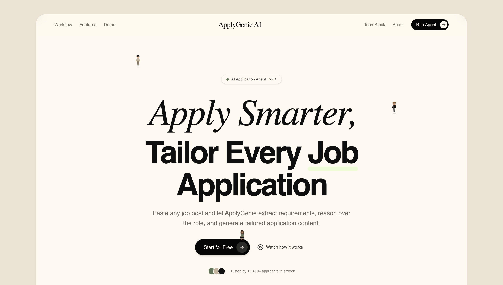
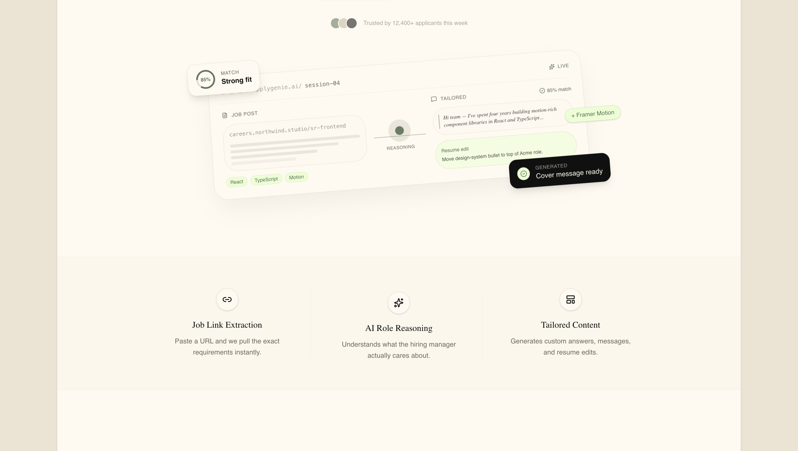
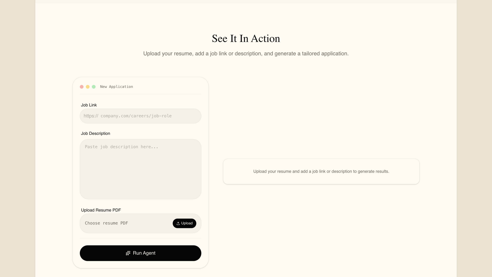
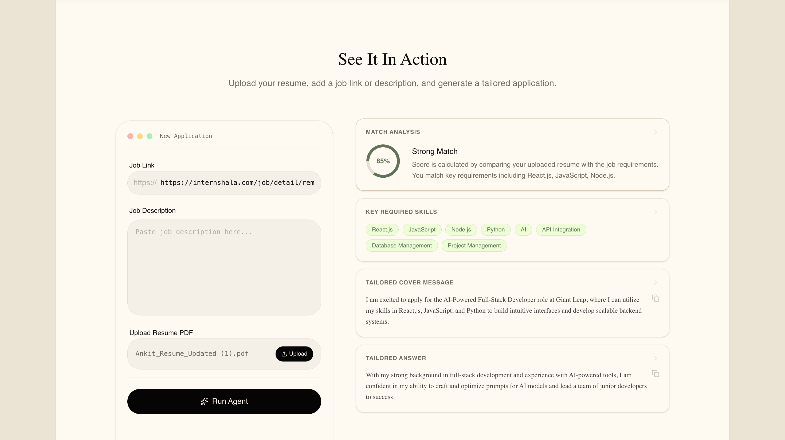
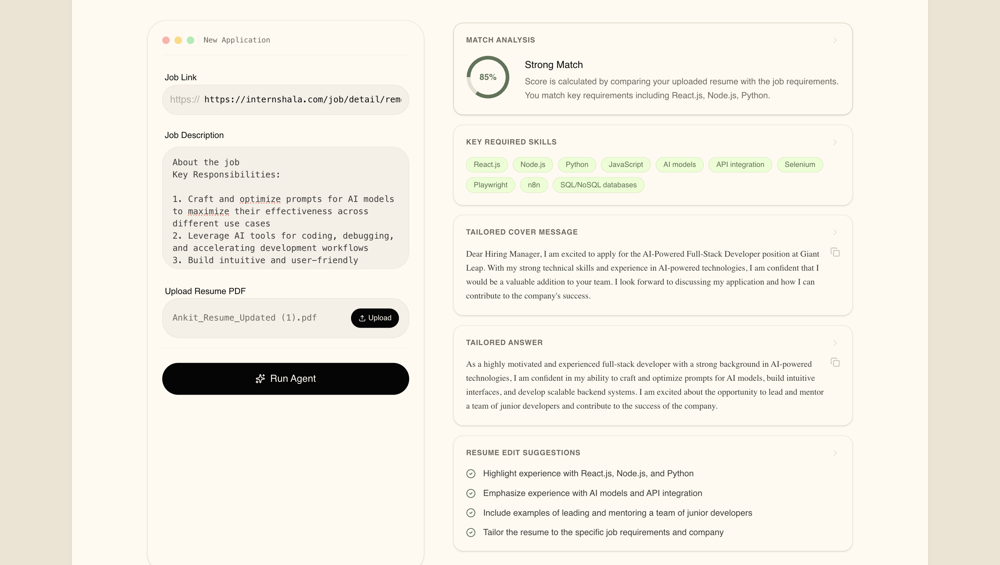
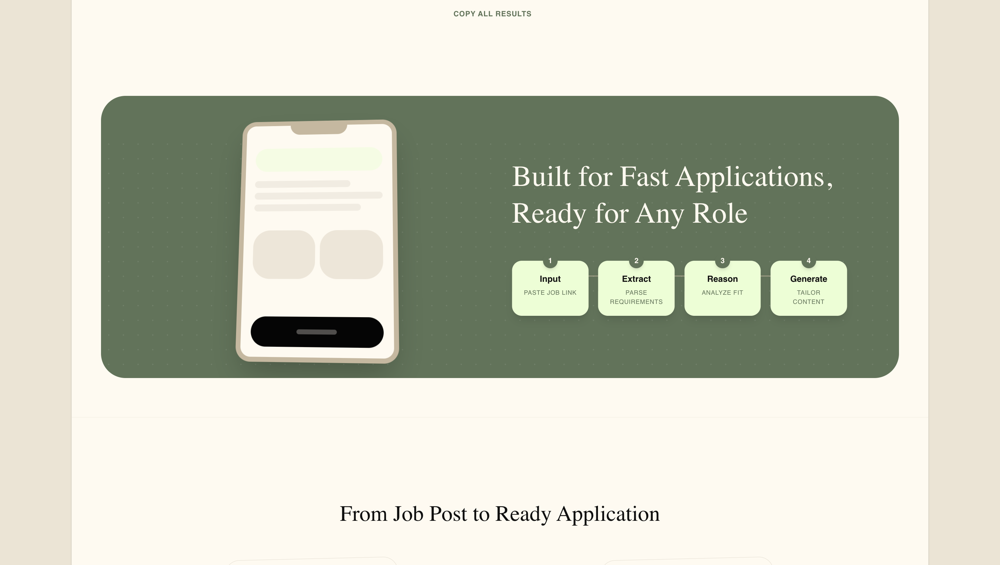
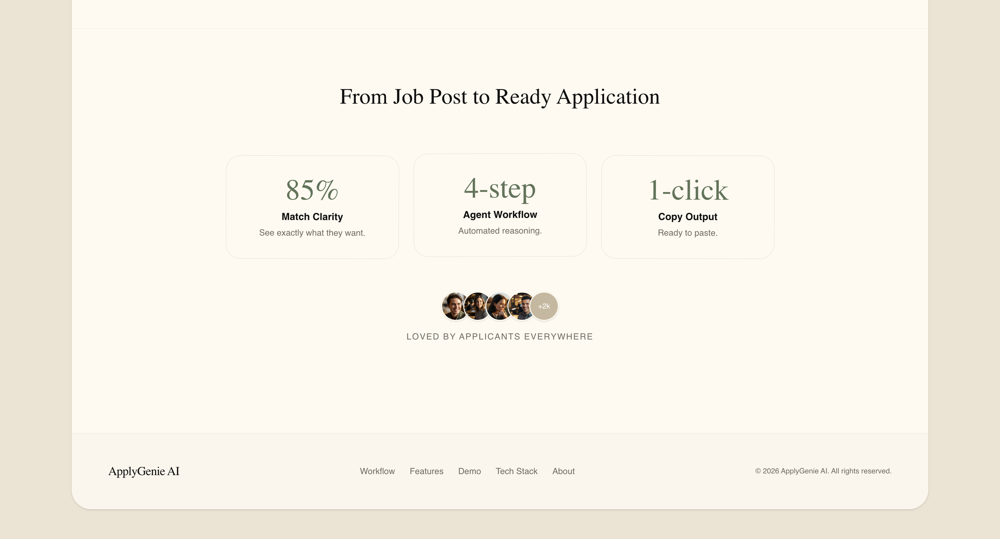
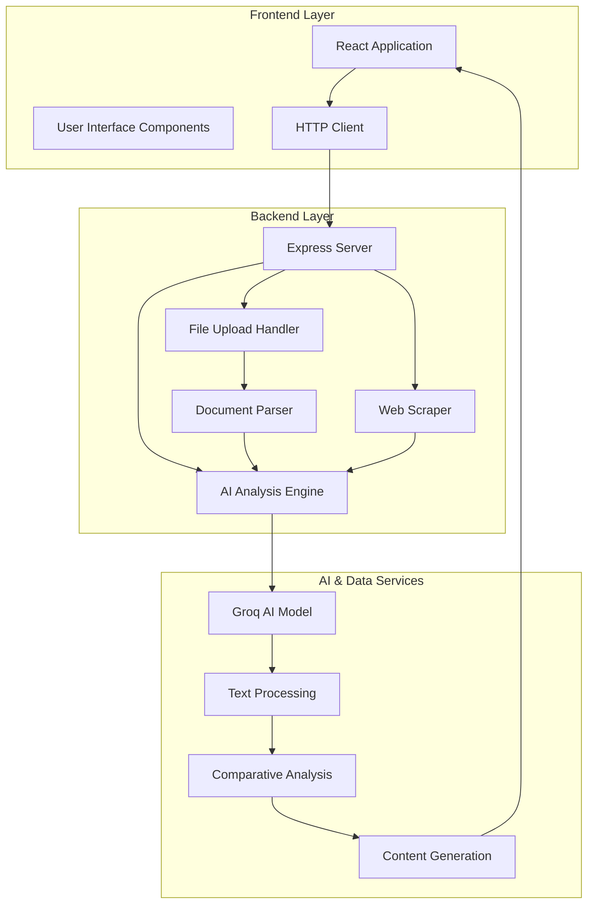
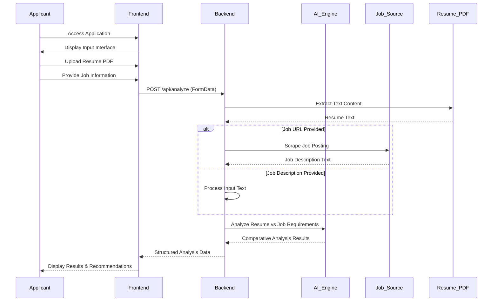

# ApplyGenie AI - Job Application Intelligence Platform

<div align="center">

[](https://github.com/Akkii88/ApplyGenie.AI-JobApplicationAgent)
[](https://reactjs.org/)
[](https://nodejs.org/)
[](https://groq.com/)
[](LICENSE)

**AI-Powered Job Application Analysis and Content Generation**

[Live Demo](#) • [Documentation](#api-documentation) • [Contributing](#contributing)

</div>

---

## Project Screenshots








## Overview

ApplyGenie AI is an intelligent full-stack web application that revolutionizes the job application process by analyzing candidate resumes against job descriptions using advanced AI. The platform provides personalized match scores, skills gap analysis, and generates tailored application content to improve job application success rates.

### Key Capabilities

- **Resume Intelligence**: PDF parsing and content analysis
- **Job Posting Analysis**: Automated web scraping and text extraction  
- **AI-Powered Matching**: Comparative analysis using Groq AI
- **Content Generation**: Tailored application materials
- **Skills Optimization**: Gap analysis and improvement recommendations

---

## Architecture



---

## How It Works

### Application Workflow



### Core Analysis Process

1. **Document Processing**: Resume PDF parsing and job description extraction
2. **Content Analysis**: Natural language processing of candidate experience and job requirements
3. **Comparative Matching**: Algorithmic comparison of skills, experience, and qualifications
4. **Gap Identification**: Analysis of missing competencies and experience
5. **Content Synthesis**: Generation of tailored application materials
6. **Optimization Recommendations**: Specific improvement suggestions for resume and applications

---

## Technology Stack

### Frontend Architecture
- **React 18** with TypeScript for type-safe component development
- **Vite** for optimized development and production builds
- **Tailwind CSS** for utility-first responsive styling
- **Framer Motion** for smooth user interface transitions

### Backend Architecture
- **Node.js** runtime with Express.js web framework
- **Groq AI** for high-performance language model inference
- **Playwright** for automated web scraping and data extraction
- **Multer** for secure multipart file upload handling
- **pdf-parse** for robust PDF text extraction

### Development Tools
- **ESLint** for code quality enforcement
- **Prettier** for consistent code formatting
- **TypeScript** for enhanced developer experience
- **Git** for version control and collaboration

---

## Installation & Setup

### System Requirements
- Node.js version 18.0 or higher
- npm package manager
- Git version control system

### Quick Start

```bash
# Clone the repository
git clone https://github.com/Akkii88/ApplyGenie.AI-JobApplicationAgent.git
cd ApplyGenie.AI-JobApplicationAgent

# Install all dependencies
npm run install-all

# Configure environment variables
cd server
cp .env.example .env
# Edit .env with your GROQ_API_KEY

# Start the application
npm run start
```

### Manual Setup

#### Backend Configuration
```bash
cd server
npm install

# Environment setup
cp .env.example .env
# Configure GROQ_API_KEY and other settings

npm run dev
```

#### Frontend Configuration
```bash
cd ../stitch-ui
npm install
npm run dev
```

### Access Points
- **Application Interface**: http://localhost:5173
- **API Endpoint**: http://localhost:5001
- **Health Check**: http://localhost:5001/health

---

## Usage Guide

### For Job Applicants

#### Document Preparation
**Resume Requirements:**
- Format: PDF only
- Maximum file size: 5MB
- Content: Selectable text (not image-based)
- Sections: Work experience, education, skills

**Job Information Options:**
- Job posting URL (automatic scraping)
- Manual job description paste

#### Analysis Process
1. Access the ApplyGenie AI application
2. Upload your resume PDF file
3. Provide job posting URL or description
4. Initiate analysis with "Run Agent"
5. Review comprehensive results (10-20 seconds processing time)

#### Results Interpretation
- **Compatibility Score**: Percentage match between resume and requirements
- **Strength Analysis**: Demonstrated competencies that align with job needs
- **Gap Identification**: Required skills or experience not present in resume
- **Application Content**: Tailored responses and messaging
- **Improvement Recommendations**: Specific resume and application enhancements

#### Application Enhancement
- Review AI-generated content
- Customize materials with personal insights
- Apply with optimized documentation
- Track application outcomes for continuous improvement

### Example Analysis Output

```
Input Parameters:
├── Resume: senior_developer_resume.pdf
├── Job Source: https://company.com/careers/frontend-architect

Analysis Results:
├── Compatibility Score: 89%
├── Demonstrated Strengths: React, TypeScript, Architecture
├── Identified Gaps: Cloud Infrastructure, DevOps
├── Generated Response: Professional "why hire me" content
├── Cover Letter Draft: Company-specific introduction
├── Resume Recommendations: Experience quantification, skill prioritization
```

---

## API Reference

### Health Verification
```http
GET /health
```

**Response Structure:**
```json
{
  "status": "operational",
  "aiProvider": "Groq",
  "model": "llama-3.3-70b-versatile",
  "timestamp": "2026-04-25T01:59:15.000Z"
}
```

### Job Analysis Endpoint
```http
POST /api/analyze
Content-Type: multipart/form-data
```

**Request Parameters:**
- `jobLink` (string, optional): Complete URL to job posting
- `jobDescription` (string, optional): Full job description text
- `resumeFile` (file, required): Resume document in PDF format

**Success Response:**
```json
{
  "summary": "Senior Frontend Architect position...",
  "skills": ["React", "TypeScript", "System Design"],
  "matchScore": 89,
  "strongMatches": ["React development", "TypeScript implementation"],
  "missingSkills": ["AWS services", "Kubernetes"],
  "tailoredAnswer": "With extensive experience in scalable React applications...",
  "coverMessage": "I am writing to express my interest in the Senior Frontend Architect role...",
  "resumeSuggestions": ["Include cloud infrastructure experience", "Quantify system performance improvements"],
  "rewrittenBullets": ["Architected and implemented React component library serving 500+ developers", "Led migration to TypeScript across 20+ applications"]
}
```

**Error Response Examples:**
```json
{
  "error": "Please upload a PDF resume."
}

{
  "error": "Please provide either a job description or a job link"
}

{
  "error": "AI analysis failed. Please try again."
}
```

---

## User Interface Components

### Primary Interface Layout

```
┌─────────────────────────────────────────────────┐
│ Header: ApplyGenie AI Branding                  │
├─────────────────────────────────────────────────┤
│ Input Section                                   │
│ ├── Job Information Input                       │
│ │   ├── URL Field or                             │
│ │   └── Description Textarea                     │
│ └── Resume Document Upload                       │
│     └── PDF File Selection                       │
├─────────────────────────────────────────────────┤
│ Action Controls                                 │
│ └── Analysis Initiation Button                   │
├─────────────────────────────────────────────────┤
│ Results Display Area (Post-Analysis)             │
│ ├── Compatibility Score Visualization            │
│ ├── Skills Assessment Cards                      │
│ ├── Generated Content Sections                   │
│ └── Optimization Recommendations                 │
└─────────────────────────────────────────────────┘
```

### Interface Features

- **Progressive Disclosure**: Results appear only after analysis completion
- **Interactive Elements**: Hover states and click feedback
- **Responsive Design**: Optimized for desktop, tablet, and mobile devices
- **Accessibility**: Screen reader compatible, keyboard navigation
- **Performance**: Optimized loading states and error boundaries

---

## Development

### Project Structure

```
ApplyGenie.AI-JobApplicationAgent/
├── server/                          # Backend application
│   ├── server.js                   # Express server configuration
│   ├── aiService.js                # AI integration and processing
│   ├── scraperService.js           # Web scraping functionality
│   ├── package.json                # Backend dependencies
│   └── .env.example                # Environment template
├── stitch-ui/                      # Frontend application
│   ├── src/
│   │   ├── components/
│   │   │   └── DemoBlock.tsx      # Main interface component
│   │   ├── index.css              # Global styles and animations
│   │   └── main.jsx               # Application entry point
│   ├── tailwind.config.js         # UI configuration
│   ├── package.json               # Frontend dependencies
│   └── index.html                 # HTML template
├── package.json                    # Root project configuration
├── run.sh                         # Development startup script
└── README.md                      # This documentation
```

### Development Workflow

1. **Environment Setup**: Configure local development environment
2. **Dependency Installation**: Install frontend and backend dependencies
3. **Configuration**: Set up API keys and environment variables
4. **Development Server**: Start both frontend and backend servers
5. **Code Modification**: Implement features with hot reloading
6. **Testing**: Validate functionality across different scenarios
7. **Code Review**: Ensure code quality and documentation standards

### Testing Strategy

- **Unit Tests**: Component and utility function testing
- **Integration Tests**: API endpoint and data flow validation
- **End-to-End Tests**: Complete user workflow verification
- **Performance Tests**: Response time and resource usage analysis
- **Accessibility Tests**: WCAG compliance verification

---

## Contributing

We welcome contributions from the developer community. Please follow these guidelines:

### Getting Started
1. Fork the repository
2. Create a feature branch from `main`
3. Implement your changes with comprehensive testing
4. Submit a pull request with detailed description

### Code Standards
- **TypeScript**: Strict type checking enabled
- **ESLint**: Code quality and consistency enforcement
- **Prettier**: Automated code formatting
- **Commit Messages**: Clear, descriptive commit history
- **Documentation**: Update documentation for all changes

### Areas for Contribution
- **AI Model Integration**: Additional language model support
- **Internationalization**: Multi-language interface support
- **Mobile Applications**: React Native companion app
- **Analytics**: Usage tracking and performance metrics
- **Security**: Enhanced authentication and data protection

---

## License

This project is licensed under the MIT License. See the [LICENSE](LICENSE) file for complete terms and conditions.

---

## Acknowledgments

### Technology Partners
- **Groq AI**: High-performance AI inference platform
- **Playwright**: Reliable web automation framework
- **React**: Modern user interface library
- **Node.js**: Server-side JavaScript runtime

### Project Inspiration
- Modern SaaS application design patterns
- AI-powered productivity tool ecosystems
- Professional recruitment technology platforms

---

## Contact & Support

- **Project Repository**: [GitHub](https://github.com/Akkii88/ApplyGenie.AI-JobApplicationAgent)
- **Issue Tracking**: [GitHub Issues](https://github.com/Akkii88/ApplyGenie.AI-JobApplicationAgent/issues)
- **Discussions**: [GitHub Discussions](https://github.com/Akkii88/ApplyGenie.AI-JobApplicationAgent/discussions)

---

## Future Roadmap

### Planned Enhancements
- **Resume Builder**: AI-assisted resume creation and optimization
- **Application Tracker**: Job application status and outcome monitoring
- **LinkedIn Integration**: Direct application posting to professional networks
- **Analytics Dashboard**: Application success metrics and insights
- **Multi-format Support**: Additional resume format compatibility

---

<div align="center">

**ApplyGenie AI - Transforming Job Applications Through Intelligent Analysis**

*Developed by Ankit - Professional AI-Powered Career Tools*

</div>
